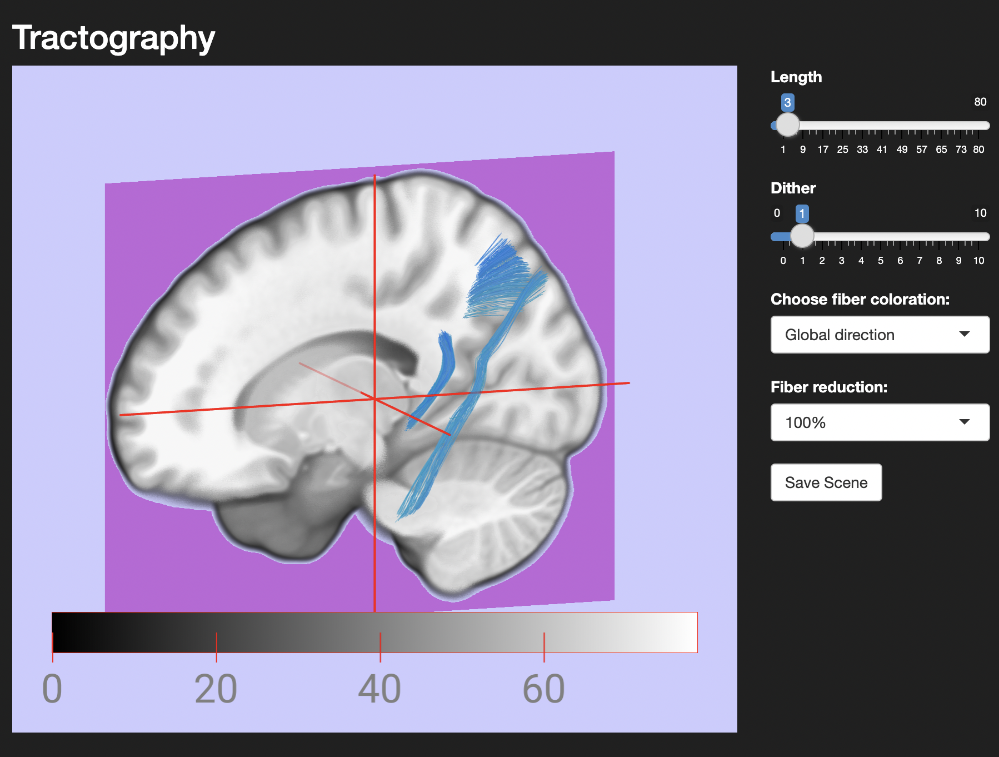
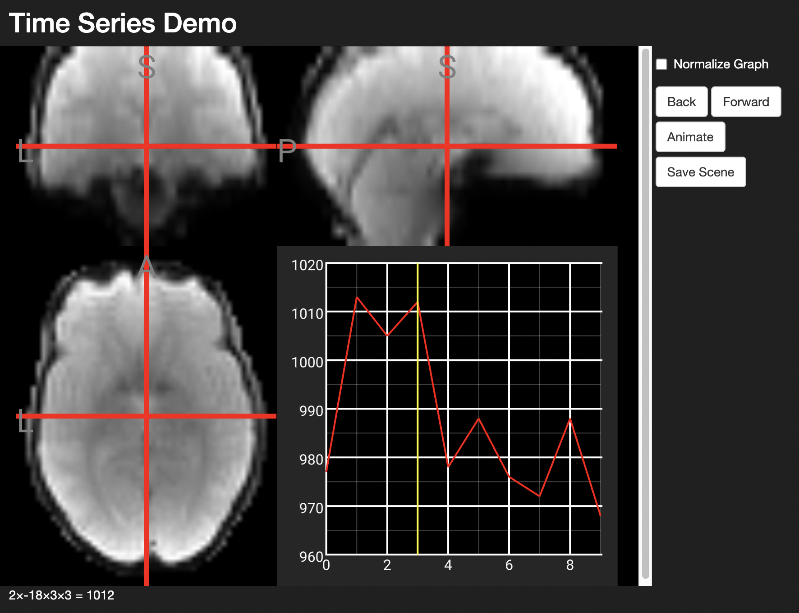

# Using NiiVue in R Shiny
[NiiVue](https://github.com/niivue/niivue) is an open-source JavaScript library for WebGL2-based medical image viewing. This R package allows you to use NiiVue from R Shiny.

# Examples
### Tractography (TCK, TRK, TRX, VTK)
Demo for [NiiVue's Tractography](https://niivue.github.io/niivue/features/tracts.html)


### Time Series Demo
Partial demo for [NiiVue's Time Series](https://niivue.github.io/niivue/features/timeseries.html) (toggle thumbnail doesn't work, but the other features do)


# Quickstart
1. Install the devtools library
```
install.packages('devtools')
```
2. Install this niivue library
```
devtools::install_github('AnthonyAndroulakis/niivue.R')
```
3. Use it (for more examples, see the examples folder)
```R
suppressWarnings(library(niivue))
library(shiny)

ui <- fluidPage(
  fluidRow(
    tags$div(style = "width: 100%; height: 600px;", NiivueWidget$new()$plot)
  )
)

server <- function(input, output, session) {
  volumeList <- list(
    list(url = "https://niivue.github.io/niivue/images/mni152.nii.gz",
         colormap = "gray")
  )

  nv <- NiivueWidget$new()
  nv$loadVolumes(volumeList)
}

shinyApp(ui, server)
```